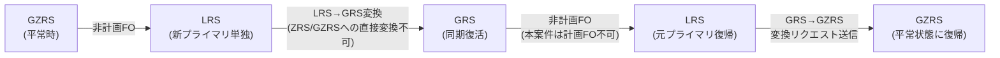
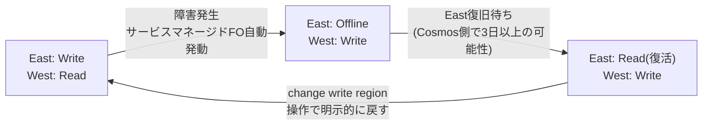

## はじめに

### こんな依頼が来たとき、一人で対応できますか？

> 「Storage Account と Cosmos DB のバックアップ・リストア・DR が全く未設計です。設計から意思決定・構築・テスト・運用確立まで、一通りお願いします」

これは私が実際に受けた依頼です。本記事は、機能の全体像と「**どのケースで何を選ぶか**」の判断軸を、担当者の一次資料としてまとめたものです。

読み終わる頃には、要件ヒアリングから設計書に落とすまでの **思考の型** が一通り手に入る、というのが目標です。

### 想定読者

次のいずれかに当てはまる方を想定しています。

- AI アプリ自体は構築済みだが、データ層のバックアップ・DR が未設計で、これから設計する方
- そもそもクラウド上のバックアップ設計をやったことがなく、何から手を付けるか分からない方
- 上記のように「一通りお願いします」と言われて、正直自信のない方

私自身、依頼を受けて実際に整理した内容です。同じ立場の方、似たような事をする方の足がかりになれば嬉しいです。

※ 本記事は **Azure 中級者・中堅インフラエンジニア** 向けです。基礎的な Azure サービス(Storage Account / Cosmos DB / VNet / Private Endpoint 等)の概念は前提としています。

### 扱うこと／扱わないこと

| 扱う | 扱わない |
|---|---|
| SA と Cosmos のバックアップ機能の整理 | AI アプリ層(AI Search／AOAI／AI Foundry)の復旧(末尾で概要のみ) |
| 機能・制約・コストの試算と現状把握の手順 | IaC(Terraform／Bicep)化の詳細 |
| 採用判断と選定理由 | スクリプトコード・GitHub Actions の OIDC セットアップ詳細 |
| **閉域前提の復旧設計(事前準備)** | |
| 本番リストアテストで考える観点 | |

### 前提環境

- リージョン：Japan East(プライマリ)／ Japan West(セカンダリ)
- ストレージ容量：200GB 程度(LRS 素の状態で月 数百〜3,000 円程度)
- Cosmos DB：200MB 程度・プロビジョンドスループット(保護機能なしで月 1 万円)

## 背景と進め方

### AI アプリの復旧構成がゼロだった

担当した環境は、AI Search・Cosmos・SA(※ 以降の本文では Storage Account を **SA**、Cosmos DB を **Cosmos** と略記します)のいずれも「とりあえず動いているだけ」で、リージョン障害／誤操作／ランサムウェアのいずれの備えもなしという状態でした。要は **データが消えたら全部終わり** です。

AI Search のインデックス復旧やアプリ層の FO（フェイルオーバー、以下 **FO**）設計は別途必要ですが、それ以前に「一次ストア(SA と Cosmos)が無事なら立て直せる」状態にしないと上位レイヤーの議論ができません。そこで「まず SA と Cosmos のバックアップ／DR を要件から組んでほしい」というオーダーで本依頼が始まりました。

### 全体の進め方

進めたステップは以下です。

```
要件ヒアリング
  ↓
【最初にやる】現状把握フェーズ
  ● 守りたいリソースの洗い出し → リスト化
  ● Azureポータルの「コスト分析」で現状の課金とデータ量を確認
  ● 料金計算ツールで「保護機能を追加した場合」の差分見積もり
  ↓
機能棚卸し(用途・制約・コスト)
  ↓
試算と提案(採用/不採用を理由付きで顧客へ)
  ↓
設計書に落とし込み
  ↓
検証環境で構築
  ↓
構築 / リストアテスト
```

### 最初にやるのは「現状把握」

要件ヒアリングが終わったあと、機能棚卸しに入る前に **必ず現状把握** を挟みます。やることは 3 つだけです。

1. **守りたいリソースの洗い出しとリスト化**：SA・Cosmos の本数、各リソースの用途、データ量、リージョン、冗長性、保護機能の現状を 1 枚の表にまとめます。これがないと議論が空中戦になります。
2. **現状コストの確認**：Azureポータルの「コスト分析」を開いて、対象リソースが何の保護機能も入っていない素の状態で、月いくら払っているかを見ます。ここを先に数字で押さえておかないと、後で「Cosmos って高いって聞きますけど…」みたいな話になった時に、話が前に進みません。
3. **追加機能の見積もり**：[Azure 料金計算ツール](https://azure.microsoft.com/ja-jp/pricing/calculator/) で、Vaulted Backup・Continuous Backup・GZRS などを一つずつ足していって、現状との差額を見ていきます。

:::message
**全部盛りにしないで顧客と合意するには、現状コストと追加分の差分を数字で出すしかない**

Azure のバックアップ機能は同じリソースに対して複数並存できるので、全部入れるとコストが膨らみます。「入れる／入れない」を顧客に納得してもらう前段として、ここで数字を作っておくと、設計判断の根拠が後から振り返れる形で残ります。
:::

### リストアテストできる状態を最優先にした

> バックアップを取り始めた瞬間に「やった気」になるのが一番危ない。

バックアップが取れていてもリストアした実績がないと、本番では確実に詰みます。本依頼では「**いつでもリストアを再現できる状態**」をゴールに据えて、検証環境で全機能の復旧を一度ずつ通しました。

## リソース階層と「壊れ方」→「打ち手」

要件ヒアリングと現状把握が済んだら、機能棚卸しに入る前に「**そもそもこのリソース、どこから壊れる可能性があるのか**」を整理します。

SA も Cosmos も、階層ごとに「消える／壊れる」が起こります。アイテム単位の誤削除、コンテナーごとの消失、アカウントそのものの削除、リージョン障害——どの粒度で壊れたかによって打ち手も変わります。**壊れ方と打ち手を 1 対 1 で結んだ地図**がないと、機能を見ても何に効くか判断できません。

### SA の階層

```
SA
 └ コンテナー
    └ Blob
       └ バージョン(自動)
```

| 壊れた階層 | 打ち手 |
|---|---|
| Blob 個別の誤削除・誤上書き | Blob 論理削除＋バージョン管理 |
| コンテナー削除 | コンテナー論理削除／Vaulted Backup |
| SA 削除そのもの | Vaulted Backup(**唯一の手段**) |
| 大量破損(ランサム等) | Operational Backup(PITR) |
| リージョン障害 | GZRS／RA-GZRS ＋ 手動 FO |

> ※ PITR = Point-In-Time Restore(ポイントインタイムリストア、特定時点への復元)

### Cosmos の階層

```
Cosmos DB アカウント
 └ DB
    └ コンテナー
       └ アイテム(ドキュメント)
```

| 壊れた階層 | 打ち手 |
|---|---|
| ドキュメント／コンテナー／DB の誤更新・削除 | Continuous PITR |
| アカウント削除 | ソフトデリート(30 日)＋ PITR |
| リージョン障害 | マルチリージョン＋ サービスマネージド FO |

### 同じ「PITR」でも中身が違う

SA と Cosmos は階層構造こそ似ていますが、**バックアップ・リストアの設計思想は大きく違います**。

SA は「コンテナー単位・Blob 単位で部分復元する」のが基本です。一方、Cosmos の PITR は「**別アカウントを丸ごと新規作成して、そこに復元する**」というアカウント単位の操作になります。

同じ「PITR」という言葉でも、復元の粒度と影響範囲が違うので、設計時に取り違えると後で手戻りが出ます。


*BKRT（バックアップリストア）おじさんが、SA と Cosmos の戻し方の違いを整理してくれています*

### 同じ「リージョン障害対応」でも構造が違う

リージョン障害への打ち手も、SA と Cosmos で設計思想が真逆です。

- **SA**：単一アカウントを GZRS で組み、障害時に手動で FO してセカンダリに切り替える「**1拠点＋切替**」型
- **Cosmos**：複数リージョンに常時データを持たせ、障害時は自動で切り替わる「**多拠点＋自動切替**」型

つまり SA は普段は片方のリージョンが「待機側」ですが、Cosmos は普段から両リージョンが稼働しています。結果、Cosmos の方が **常時コストは高くつくが、復旧は速い** という性質になります。


*今度はDRおじさんが、閉域 × DR の世界を整理してくれています*

## SA のバックアップ機能まとめ

### 素のコスト感(保護機能なしの状態)

200GB の SA は、保護機能を **何も入れていなくても** LRS 素の状態で月 **数百〜3,000 円程度** かかります(容量＋トランザクション)。今回の議論は「もう払っているこの金額」に対して、保護機能を **どう積み増すか** という話になります。前章で書いた現状把握がここで効いてきます。

### 機能一覧

SA で使える保護機能は、次の 5 つです。

| 機能 | 守る対象 | 主な制約 | コスト感 |
|---|---|---|---|
| Blob 論理削除 ＋ バージョン管理 | Blob 単体の誤削除・誤上書き | 保持期間(既定 7 日)内のみ | 変更・削除分の容量増分のみ |
| コンテナー論理削除 | コンテナーごと削除 | 保持期間(既定 7 日)内のみ | ほぼ無料 |
| Operational Backup(PITR) | 大量破損／アカウント内巻き戻し | コンテナー削除・SA 削除は対象外。復元中は SA 全体の読み書きブロック | 保持期間分(30 日)の容量 |
| Vaulted Backup | **SA 削除そのもの**／別アカウントへの復元 | 復元先は別 SA、コンテナー名にタイムスタンプ自動付与 | Vault 容量 ＋ GB あたり保管料 |
| GZRS／RA-GZRS | リージョン障害 ＋ AZ 障害 | LRS／ZRS だと FO 不可 | LRS の約 2.5 倍 |

ざっくり「下に行くほど守備範囲が広く、料金も上がる」構造です。

### 運用上の罠：Vaulted Backup のロール自動付与

:::message
**Vaulted Backup の「不足しているロールの割り当て」はAzureポータルのみ自動付与**

Backup Vault のマネージド ID にはバックアップ／復元時のロール(Storage Account Backup Contributor)が必要ですが、Azureポータルでは「不足しているロールの割り当て」ボタンで自動付与されます。**CLI 経由(`az dataprotection`)はこの自動化が無く、事前に手動付与が必要**です。スクリプト化するときに見落としやすいポイントです。
:::


*Azureポータルでは「不足しているロールの割り当て」が1クリックで自動付与される*

:::details コラム：計画 FO がほぼ押せない構造になっている

ストレージの FO には **計画** と **非計画** の 2 種類があり、[Microsoft Learn：ストレージの障害復旧ガイダンス](https://learn.microsoft.com/ja-jp/azure/storage/common/storage-disaster-recovery-guidance) によれば計画 FO の実行条件は次のとおりです。

- Blob 以外のサービス(Files／Queues／Tables)にデータが無いこと
- **`$logs` / `$blobchangefeed` などのシステムコンテナーが存在しないこと**
- アカウントが "Ready to failover" 状態、冗長性が GZRS または RA-GRS であること

このうち 2 つ目が地雷で、**変更フィードを有効化すると `$blobchangefeed` が自動生成**されます。本構成は Operational Backup(PITR)の前提として変更フィードが ON なので、`$blobchangefeed` が常に存在し **計画 FO は実質ブロック** されます。

つまり Microsoft の仕様として **「PITR を使うこと」と「計画 FO を使うこと」はほぼ両立しません**。年 1 回の計画 FO 訓練を入れる流派の方は要注意で、本依頼では **FO は非計画一択(後に LRS → GZRS 再設定が必要)** で運用ドキュメントを揃えました。
:::


*変更フィードを有効化すると `$blobchangefeed` が自動で作られ、計画 FO がブロックされる*

## Cosmos のバックアップ機能まとめ

### 素のコスト感(保護機能なしの状態)

Cosmos は **200MB 程度のデータでも、バックアップを何も入れていない素の状態で月 1 万円程度** かかります。データ量よりまず「アカウントが立っていてコンテナがあること」自体のコストが乗ります。

SA と感覚がまったく違うので注意です。SA は「データ量に比例して安く始められて、保護機能を足すたびに上がっていく」のに対し、**Cosmos は最初の一歩で既に 1 万円のスタート地点** にいます。

::::details なぜ「使ってないのに1万円」なのか — RU/s と「いきなり月数十万円」を防ぐガードレール

#### RU/s の話

Cosmos のプロビジョンドモードでは、**RU/s (Request Unit per second)** という単位でスループットを事前確保します。RU は「読み取り・書き込み・クエリなど 1 回の操作に必要な処理量」を表す指標で、たとえば 4KB のドキュメントを 1 回読み取るとおよそ 4 RU を消費します。

[公式の最低保証は、コンテナまたは shared throughput データベース 1 つあたり **400 RU/s**](https://learn.microsoft.com/ja-jp/azure/cosmos-db/concepts-limits) です。料金は **マニュアルで $0.008 / 100 RU/s / 時間** (オートスケールはこの 1.5 倍)。

月額に直すと、

- 400 RU/s × 1 コンテナ：**約 3,500 円/月**
- 400 RU/s × 3 コンテナ：**約 10,500 円/月** ← これが「1 万円スタート」の正体

データが 200MB だろうが、コンテナが複数あればその数だけ最低 RU/s が積み上がり、何も操作していなくてもこの金額が走り続けます。

#### 使いすぎ防止：「アカウント全体スループット上限」を設定する

これを放置すると、誰かが誤ってコンテナを増設したり、オートスケールの上限が高い設定だったりした時に課金が跳ねます。Cosmos には **アカウント全体のスループット上限** を設定する機能があります(Azureポータル → Cosmos DB アカウント → 「Account Throughput」)。

- 新規アカウント作成時：チェックボックスで **4,000 RU/s 上限** に制限可能
- 既存アカウント：いつでも上限値を変更可能

参考：[Microsoft Learn：アカウントの合計スループット制限](https://learn.microsoft.com/ja-jp/azure/cosmos-db/limit-total-account-throughput)

「いきなり月数十万円」を防ぐガードレールとして必須レベルの機能です。

:::message alert
**ハマりポイント：マルチリージョン追加でスループット上限に引っかかる**

リージョンを追加すると、設定した RU/s は **追加リージョン側にもそのまま反映** されます。つまり合計 4,000 RU/s で動いているアカウントに Japan West を追加すると、課金対象は 4,000 × 2 = **8,000 RU/s** にカウントされます。

このとき **アカウント全体スループット上限を 4,000 RU/s のままにしておくと、リージョン追加で上限超過して操作が失敗します**。リージョン追加の前に、**上限値をリージョン数倍** (2リージョンなら2倍)に上げるか、一時的に外す必要があります。

「Japan West を増やすだけなのに、なぜか失敗する」というハマり方をするので要注意です。
:::

::::

### 機能一覧

Cosmos で使える保護機能は、次の通りです。バックアップだけで **3 つのモード** があるので、まずそこから整理します。

| 機能 | 守る対象 | 主な制約 | コスト感 |
|---|---|---|---|
| **Periodic Backup(既定)** | アカウント全体(限定的) | **リストアに Microsoft サポート問い合わせが必要** | 2 コピーまで無料 |
| **Continuous Backup 7 日** | ドキュメント／コンテナー／DB／アカウント | 復元は **別アカウント新規作成** | 無料 |
| **Continuous Backup 30 日** | 同上 | 同上(より細かい時点に戻せる) | ストレージ単価ベース |
| ソフトデリート(30 日) | アカウント削除そのもの | 30 日経つと完全削除 | 無料 |
| マルチリージョン書き込み／読み取り | リージョン障害 | 追加リージョン分の RU／ストレージが対称に課金 | リージョン数だけ倍 |
| サービスマネージド FO | 実障害時の自動切替 | **デフォルト無効・有効化要**。障害最中の手動 FO は不可(両リージョン疎通が必要) | 無料 |

**既定の Periodic Backup は実質「使えないバックアップ」です**。リストアするには Microsoft サポートにチケットを切る必要があり、復旧の主導権をこちら側で持てません。新規アカウントを作るなら、**最低でも作成時点で Continuous Backup 7 日に切り替え**、「もっと前に戻したい」要件があれば **30 日** に上げる、というのが現実的な選択になります。

SA と比べると機能数は多くないですが、「無料で守れる範囲」が決まっていて、本気で守るなら **マルチリージョン化** で課金がリージョン数だけ倍になる構造です。Japan East ＋ Japan West の 2 リージョン構成なら、RU/s もストレージも単純に **2 倍** になります。

### 運用上の罠：TTL 一斉削除

:::message alert
**PITR 後の TTL 一斉削除を防ぐオプションは CLI のみ**

TTL を 7 日に設定しているコンテナーで、10 日前の時点に PITR したら、復元直後に **「期限切れ」と判定されたドキュメントが一斉削除される**——これがリストアテスト中に気づいた挙動です。

これを防ぐオプション(CLI なら `--disable-ttl True`)は **Azureポータルには存在しません**。Cosmos の PITR は CLI(または PowerShell)から実行するのが安全です。
:::

### 運用上の罠：PITR の後、設定が空っぽのアカウントを渡される

:::message
先ほど「同じ"PITR"でも中身が違う」で触れたとおり、Cosmos の PITR は **別アカウントを新規作成して復元** する仕組みです。これが意味するのは、**ネットワーク・IAM・拡張機能の設定はデータと一緒には戻らない** ということです。

SA や VM のリストアでも「構成は戻らない、データだけ戻る」は同じですが、SA は同じアカウントへの部分復元、VM もインスタンス ID を保持して再起動できるケースが多い。**Cosmos だけは必ず別アカウント** になる点が、運用上の最大の罠です。

再設定が必要な具体項目と手順は、後述「**なぜ事前準備が要るのか**」で整理します。
:::

### 運用上の罠：手動 FO とサービスマネージド FO の使い分け

:::message
**実障害時は基本「サービスマネージド FO 任せ」、ただし有効化していないケースもある**

サービスマネージド FO を有効にしていれば、実障害でプライマリが落ちた際に Cosmos 側の判断で **自動的にセカンダリへ切り替わります**。このケースで手動 FO を叩く必要はなく、そもそも **両リージョンの疎通が必要なので叩いても失敗します**。

ただし、**サービスマネージド FO を有効化していない構成** も存在します（サービスマネージド FO は **デフォルト無効** で、Microsoft の責任分界モデル上、HA 機能の有効化は利用者判断に委ねられている）。運用ポリシーや設計判断、あるいは単純に未設定で手動切替になっている場合は、運用ルールで「障害発生時、誰が・どのタイミングで手動 FO を叩くか」を決めておく必要があります。

**個人的な推奨は、サービスマネージド FO 有効化(無料)＋ 手動 FO は訓練・計画移設・自動が発動しないレアケースに限定** です。実障害時に人手の判断を挟まずに済む構成が、運用が一番楽です。
:::


## 採用判断

機能棚卸しと試算が済んだら、いよいよ「何を採用するか」を決めます。本依頼で実際に下した判断と、その理由を残しておきます。

### SA：冗長性は GZRS(GRS ではなく)

SA の冗長性は **GZRS(Geo-Zone-Redundant Storage)** を採用しました。GRS との違いは「プライマリ側で何コピーを持つか」です。

| 冗長性 | プライマリ側 | セカンダリ側 | 守れる障害 |
|---|---|---|---|
| GRS | LRS(同 DC 3 コピー) | LRS | リージョン障害のみ(プライマリ側の AZ 障害は守れない) |
| **GZRS** | **ZRS(3 AZ)** | **LRS** | **AZ 障害 ＋ リージョン障害の両方** |

Japan East は AZ 対応リージョンなので、内側で ZRS を取れる GZRS が選択肢に入ります。**ゾーン単位の障害は実例がある頻度で起きる** ため、プライマリの可用性を AZ 冗長で確保し、リージョン障害には FO で備える二段構えにしました。単価差は 200GB スケールで月数百〜千円規模で、AZ 障害を勝手に乗り越えてくれる見返りを考えるとペイします。

### Backup Vault の冗長性は LRS

一方、Backup Vault の冗長性は **LRS** です。一次データ SA を GZRS で組んでいるため、Vault 側まで GRS／GZRS にすると **冗長性が三重で過剰** だからです。リージョン障害の打ち手は SA 側の FO(GZRS)に集約し、Vault は「同一リージョン内の論理障害(誤削除・大量破損・SA 削除)」を担う役割分担にしました。

### Cosmos：Continuous Backup 7 日 ＋ サービスマネージド FO

Cosmos 側の判断は以下です。

- **Continuous Backup は 7 日(無料)を採用**：要件として「過去 7 日以内に戻せれば十分」だったため、有料の 30 日は採用せず
- **マルチリージョン(読み取りレプリカ)を Japan West に追加**：リージョン障害時にデータが消えないよう、最低限の冗長性を確保
- **サービスマネージド FO を有効化**：実障害時の自動切替を Cosmos に任せる(手動 FO は訓練枠のみ)

「Periodic Backup 既定のまま」「マルチリージョンなし」だと、いざという時に **MS サポート問い合わせ＋長時間ダウン** が確定するので、ここはケチらない判断にしました。

### 決め方の原則

機能を全部盛りにせず、**「どの障害をどの機能で拾うか」を役割分担で決める**、というのが本依頼の決め方でした。

たとえば SA で言えば、「同一リージョン内の誤削除・大量破損・SA 削除」は **Backup Vault** に任せ、「リージョン障害」は **GZRS の FO** に任せます。同じ障害を 2 つの機能で守ろうとすると、料金が無駄に膨らむし、運用も複雑になるので避けています。

本依頼で堅牢寄りに組んだのは、SA が **API Function 多数の依存先**、Cosmos が **会話履歴の保管先** という事情から。どちらも「消えたら複数ユーザーが詰む」場所でした。

ただし、これは一例にすぎません。**自分のケースは何を失ったら詰むのか** を起点に、必要な機能だけ積むのが王道です。


## 閉域前提の復旧設計

ここまで機能・コスト・採用判断を整理してきましたが、実は **私が一番書きたかったのはここから先** です。閉域構成でリストアや FO を実施するとき、**事前準備をどれだけやっておいたかで成否が決まる**——という話で、本作業で痛感した部分です。

機能の話だけでは見えない「実施時に何が起きるか」「事前に揃えるべきリソースは何か」を、順に整理していきます。


### なぜ事前準備が要るのか

リストアや FO を実施するときに「事前準備が要る」と一括りで書いてしまいがちですが、**FO とリストアでは事前に揃えるものが違います**。まずそこを整理します。

| 操作 | リソース | FQDN |
|---|---|---|
| **Cosmos の PITR** | 別アカウントで新規作成 | **変わる** |
| **SA の Vaulted Backup** | 別 SA に復元 | **変わる** |
| **SA / Cosmos の FO** | 同じリソースのまま | **変わらない** |

公式([Microsoft Learn:プライベート エンドポイントを使用するストレージ アカウントのフェールオーバーに関する考慮事項](https://learn.microsoft.com/ja-jp/azure/storage/common/storage-failover-private-endpoints))にも明記されています。

> ストレージ アカウントがフェールオーバーされると、サービス自体の名前は変更されません。

> DNS に対する変更は必要ありません。各リージョンは引き続きローカル エンドポイントを使用してストレージ アカウントと通信できます。

#### リストア時に発生する作業

PITR や Vaulted Backup では **新リソース**(別 FQDN)が立ち上がるので、新リソースに対して周辺一式をセットアップし直す必要があります。

- 新リソースに PE を紐づけて、PDNS に **新 FQDN の A レコード** を追加
- マネージド ID を再設定して、データプレーン RBAC を付け直す
- 診断設定を有効化して、Log Analytics の送信先を復元元と同じ Workspace に向け直す

これらを **平常時に Terraform で書いておき、新リソースが立った瞬間に state を向け直して `terraform apply`** を流す、というのが現実的な運用です。手作業だと PE の伝搬・名前解決確認・IAM 反映でそれぞれ待ち時間が出て、復旧時間がそのまま伸びます。

#### FO 時に発生する作業

FO の場合は **SA / Cosmos のリソース自体は同じまま** で、プライマリ書き込みリージョンだけが切替先に移ります。FQDN も DNS も変わりません。

ただし閉域構成では、**切替先のリージョンに PE と PDNS Zone が無いと、そもそも切替先からアクセスできません**。だから事前に切替先リージョンに、

- PE(切替先 VNet 内)
- Private DNS Zone(切替先専用)
- NSG / マネージド ID / Log Analytics / 診断設定

を **対称に並べておく** 必要があります。事前準備さえ済んでいれば、FO 時の追加作業は基本的にゼロです。

つまり事前準備のゴールは、

- **リストア用**: 新リソース立ち上げ時に流す Terraform を平常時から書いておく
- **FO 用**: 切替先リージョンに PE・PDNS・周辺リソースを対称に並べておく

どちらも、障害発生後に手で叩いて回すのは現実的じゃないので、平常時の Terraform で「いつでも流せる」「両リージョン対称」を作っておきます。

ここから先の見出しでは、その並べ方を、**PDNS の落とし穴 → 周辺リソースの並べ方 → URL 周知の運用** の順に見ていきます。

### リージョン RG 分離と PDNS 設計

閉域でマルチリージョン化するとき、最初にやってしまいがちなのが「**Private DNS Zone はグローバルリソースだから、東日本のリソースグループに 1 つ作っておけば、両リージョン分のレコードをまとめて管理できるんじゃないか**」という発想です。素直で合理的に見えますが、これは **公式が明確に NG と書いています**。

#### PDNS Zone はリージョンごとに分ける（公式の制約）

Cosmos と SA の公式ドキュメントが、両方とも同じことを言っています。

[Microsoft Learn:プライベート エンドポイントのフェールオーバーに関する考慮事項 (Cosmos DB)](https://learn.microsoft.com/ja-jp/azure/cosmos-db/failover-considerations-for-private-endpoints) より:

> 2 つのプライベート エンドポイントは、同じエンドポイントに同じプライベート DNS ゾーンを使用できません。 その結果、各リージョンには独自のプライベート DNS ゾーンがあります。

[Microsoft Learn:プライベート エンドポイントを使用するストレージ アカウントのフェールオーバーに関する考慮事項](https://learn.microsoft.com/ja-jp/azure/storage/common/storage-failover-private-endpoints) も同じく:

> 2 つのプライベート エンドポイントでは、同じエンドポイントに同じプライベート DNS ゾーンを使用することはできません。その結果、各リージョンは独自のプライベート DNS ゾーンを使用します。

理由はシンプルで、Azure の PDNS Zone は **PE の自動連携機能を使う場合、1 つの FQDN に対して 1 つの IP しか登録できない** からです。

PE を PDNS Zone に紐付けると、自動で `<アカウント名>.privatelink.blob.core.windows.net → 東日本PEのIP` という A レコードが作られます。**ここに 2 つ目の PE(西日本側)を同じ Zone に紐付けると、既存のレコードが西日本の IP で上書きされます**。これは [Microsoft Q&A の公式回答](https://learn.microsoft.com/ja-jp/answers/questions/1661290/) でも「This actually expected behavior」と明言されている、仕様通りの挙動です。

公式ドキュメントの原文:

> 1 つの Azure サービスにリンクされている既存のプライベート DNS ゾーンを、2 つの異なる Azure サービス プライベート エンドポイントに関連付けないでください。これにより、最初の A レコードが削除され、それぞれのプライベート エンドポイントからそのサービスにアクセスしようとしたときに解決の問題が発生します。

:::message
**「じゃあ A レコードを手動で複数 IP 登録すればいいんじゃないか?」と思うかもしれませんが、これも閉域フェールオーバーには使えません。**

Azure DNS の仕様としては、1 つの A レコードセットに**手動で最大 20 件の IP を登録することは可能** です(ラウンドロビン)。ただし閉域構成では、東日本クライアントから西日本の IP が返ったところで、**VNet ピアリングがない限り届かない**(届かせる構成にした時点でリージョン分離の意味が薄れる)。フェールオーバー目的の名前解決手段としては成立しません。
:::

結論として、「平常時は東、東が落ちたら西」という発想は、PE 自動連携でも手動 A レコードでも実現できません。**リージョン別に PDNS Zone を分けるのが唯一の解** です。


*DRおじさん、ハマりそうポイントについて整理してくれて助かる*

そうなると、公式推奨のパターンはこうなります。

- **東日本のリソースグループ**:東日本の PE ＋ 東日本専用の PDNS Zone
- **西日本のリソースグループ**(DR 用に別途切る):西日本の PE ＋ 西日本専用の PDNS Zone

PDNS Zone そのものはグローバルリソースですが、**1 つの Zone に両リージョン分のレコードを共存させられない以上、結果としてリージョンごとに Zone を分ける** ことになります。

さらにややこしいのが、Private DNS Zone は確かにグローバルリソースであるにもかかわらず、[Microsoft Learn:ハイブリッド DNS 設計](https://learn.microsoft.com/ja-jp/azure/architecture/hybrid/hybrid-dns-infra) によれば:

> プライベート DNS ゾーンはグローバル リソースですが、特定のリージョンに関連付けられているリソース グループにデプロイします。

つまり、グローバルだと言いつつ **物理的な RG はリージョンに紐づきます**。東日本の RG に置いた PDNS Zone は、東日本リージョンが落ちると **管理操作(メトリクス取得・設定変更)が一時的にできなくなる可能性** があります。これも、西日本側に専用の RG と PDNS を持っておくべき理由になります。リージョン障害時、セカンダリ側で操作が完結する形に。

#### RG 分離の運用方針

具体的な RG 構成はケースバイケースですが、本番／本番同等の既存 RG に加えて、**末尾に `-jpw` のようなリージョンサフィックスを付けた Japan West 用 RG を並列に用意する**、というのがやりやすい形です。

- リージョンごとのリソース所有・課金が見やすい
- IaC で Japan East と Japan West を **対称に書ける**
- リージョン障害時、Japan West 側の RG だけで操作が完結する

**「グローバルリソースだから 1 つでいい」と油断せず、最初からリージョン対称に切る** のが結局一番堅いです。

なお、ここまでの PDNS Zone をリージョン別に分ける話は、**FO 時(リージョン跨ぎ)** の話です。

**リストア時(同じリージョン内で別アカウントが立ち上がる場合)** は、新リソースの FQDN は別物なので、PDNS Zone を増やす必要はありません。Terraform の state を新リソースに向け直して `terraform apply` を流せば、PE の自動連携で **新 FQDN の A レコードが既存 PDNS Zone に追加** されます。

旧 A レコードは別レコードとして PDNS Zone に残るので、不要になった時点で Azureポータルまたは CLI で削除しておきます。

### 周辺リソースの事前準備と切替手順

先ほど PDNS をリージョン別に分ける話を書きましたが、**同じ発想が PE・NSG・IAM・監視にも当てはまります**。プライマリ前提で組まれた閉域構成のままだと、セカンダリに切り替わった瞬間に「経路がない・認証が通らない・ログが取れない」で詰みます。

両リージョンに **鏡像** を作っておく、というのがここの一言要約です。

#### 事前準備するリソース(両リージョン対称)

| カテゴリ | リソース | なぜセカンダリ側にも必要か |
|---|---|---|
| ネットワーク | VNet / Subnet / PE / NSG | セカンダリにも閉域経路がないと、切替後にアプリから繋がらない |
| 名前解決 | Private DNS Zone | PE 単位で別レコードになるため、リージョンを跨いで共有できない |
| 認証 | マネージド ID / RBAC ロール割当 | リージョンリソースなので両側で持つ。データソース新アカウントへの紐づけも切替先で別途必要 |
| 監視 | Log Analytics / 診断設定 | 切替後もログが途切れないよう、セカンダリにも Workspace を用意 |

ポイントは、これら全部を **IaC で対称に書く** ことです。手作業で揃えると、ほぼ確実に差異が出ます。「東側 NSG ルール 12 個、西側 10 個」みたいな状態になった瞬間、復旧時に何が原因で繋がらないのか追えなくなります。

実装面でいうと、**RG をプライマリ用とセカンダリ用に分けて切り、各 RG 内に PE と PDNS Zone を並べる** のが一番ラクな形です。「PDNS をリージョン別に分けないと」と意識しなくても、リソース構造を分ければ結果としてそうなります。

:::message
**マネージド ID は「使うリソースと同じレイヤー」で持つ**

ユーザー割当か、システム割当かは要件次第ですが、いずれの場合も **その ID を使うリソースと同じレイヤーで apply する** のが結局ラクです。共通レイヤーに集約してしまうと、リストアで新アカウントが立った時にロール紐づけのタイミングがズレて、復旧手順が一段複雑になります。
:::

#### URL 周知と DNS 向き先の確認

リージョン切替を実施すると、利用者から見えるエンドポイントが変わる可能性があります。**カスタムドメインの有無で、確認すべきポイントが変わります**。

| 観点 | 確認すること |
|---|---|
| カスタムドメイン無し | エンドポイント FQDN がそのまま変わる。新 URL を利用者に伝える手段(社内メール・運用窓口・掲示)を平時に決めておく |
| カスタムドメイン有り | URL は変わらないが、**企業 DNS のレコードが切替後の向き先(セカンダリのフロントエンド)で名前解決できる状態か**を確認しておく |
| Front Door / Traffic Manager | 正常性プローブの動作と、セカンダリへのトラフィック振り分けが想定どおりかを切替前に確認 |
| 共通 | 周知や DNS 操作を **誰が・どの経路で** 行うかを運用ルールに明記 |

技術側より連絡側で詰まるケースが多いので、ここを決めずに障害を迎えると復旧時間がそのまま伸びます。

#### 障害時の切替手順

実障害時は、次の順序で動かすのが現実的です。

1. **IaC でセカンダリ側にアプリレイヤーをデプロイ**(常駐させていない場合)
2. **セカンダリ側で動作確認**(PE 経由で SA・Cosmos に到達できるか)
3. **データソース側の切替**
   - SA → 手動で非計画 FO
   - Cosmos → サービスマネージド FO の自動発動を確認
4. **新 URL の周知、もしくは企業 DNS の切替**
5. **平常運用へ**

意外と効くのが **2 の動作確認** です。データソースを切り替える前に「セカンダリからアクセスできる状態か」を見ておかないと、切替後にアプリから繋がらない時、原因が経路側なのかデータ側なのか切り分けできなくなります。


### IaC を腐らせない運用

切替先リージョンに鏡像を作っておく、というのは「Terraform を `plan` → `apply` できる状態を平常時から維持しておく」ことと同義です。日々の運用で IaC が腐っていくと、いざという時に流せません。FO に備える観点とバックアップリストアに備える観点、それぞれで意識することがあります。

#### FO に備える観点

- **Provider バージョン固定**:Terraform 本体と AzureRM Provider のバージョンを `required_providers` で固定する。バージョン差で plan に差分が出るので、リソース構成を変えていないのに `apply` で意図しない変更が走るのを防ぐためです。チーム運用なら `tenv` などの Terraform バージョン管理ツールを併用して、**メンバー間で Terraform 本体のバージョンがばらつかないように** しておきます
- **state の分離**:プライマリ用とセカンダリ用で state を分けます(workspace を切るか、backend を別にする)。**片方の `apply` が他方を巻き込まない** ようにするためで、リストアや FO の作業中にプライマリの state まで触ってしまう事故を防ぎます
- **定期 plan**:月1回でも `plan` を流して、差分なしを確認します。**差分が出ているなら IaC が壊れているサイン** で、本番障害時に「`apply` したら想定外の変更まで走った」を防ぐ早期検知になります

#### バックアップリストアに備える観点

PITR や Vaulted Backup で **別アカウントが立ち上がった後**、その新リソースを IaC 管理下に取り込む手順を平常時から整えておきます。当日に手探りでやるのは事故のもとです。

- **新リソースの `terraform import`**:リストア直後の新アカウントは IaC 管理外なので、まず `import` で state に取り込む。**コマンドの引数(リソース ID)を当日に組み立てると詰まる** ので、ランブックにコピペで使える形で残しておきます
- **旧リソースの `terraform state rm`**:不要になった旧アカウント・旧 PE は state から外しておく。**state に残したまま `apply` を流すと、まだ生きているリソースを destroy しに行く** 危険があります
- **import → 再 apply の順序**:import で取り込んだ後、Terraform コード側を新リソース向けに修正して `apply` で構成(PE 紐づけ、IAM、診断設定)を当て直します。順序を間違えると plan に差分が大量に出て判断ができなくなります


## リストアテストの観点

バックアップは設定して終わり、ではなく、**戻せるかをテストして初めて使える** ものです。本番投入前に最低1回、運用開始後も定期的に通します。

テストを実施することで、設計書だけでは見えないものが手に入ります。

- **準備したリソースや設定が頭に入る**:平常時に組んだ鏡像構成や IaC を実際に手で動かして通すので、構成の細部まで自分の中に入る
- **「理論上いける」と「実際にいける」のギャップに気づける**:設計上は問題なくても、PE の伝搬待ち・IAM 反映遅延・TTL 一斉削除のような **実機固有の引っかかり** は、テストでしか出てこない
- **再現性を上げる工夫が見える**:「この手順、毎回手で打つのは無理」「ここはスクリプト化したほうが早い」といった **改善点** が、実施して初めて出てくる
- **実績として残せる・手順として初めて確立する**:設計書はあくまで設計。**テストを通った手順だけが「実行できる」と保証された手順** になる

こうして手を動かして得た **手順と注意点を文書化したもの** が、SRE 領域でいう **ランブック** です。本番障害時に頭が真っ白でも動けるよう、平常時に整えておきます。SRE 観点でも、ランブックがあるかないかで復旧時間が文字どおり桁で変わります。

:::message
**ランブックは必須**

「自分が1回通したから大丈夫」では足りません。**他のメンバーがその文書だけで同じことを実行できる** 状態までを成果物にします。実施日・実施者・所要時間・つまずきポイントもセットで残しておきます。
:::

### FO 後のフェイルバック手順（リストアテストで練習しておく）

FO で切り替えるところまでは情報も多いですが、**復旧後にどう元の状態に戻すか（フェイルバック、以下 FB）** は意外と書かれていません。「障害は乗り越えたが平常時の状態に戻せない」では困るので、FB 手順も練習対象に含めました。

#### SA：非計画 FO 後は LRS に降格する

これが意外と知られていない罠です。**非計画 FO を実行すると、新プライマリ側の冗長性は元の構成に関係なく LRS になります**。GZRS には直接戻せず、必ず GRS を経由する必要があります。



:::message alert
**本案件特有の制約**：先述の「コラム：計画 FO がほぼ押せない構造」のとおり、本案件は Operational Backup PITR を使う関係で計画 FO がブロックされます。結果、**FB も非計画 FO** になり、戻した先でまた LRS から GRS、そして再度 GZRS への変換リクエスト、という手順を踏む必要があります。「データ損失ゼロの計画 FB はできない」前提で運用ランブックを組みました。
:::

参考：[Microsoft Learn：Azure Storage アカウントの顧客管理対象による計画外フェールオーバーのしくみ](https://learn.microsoft.com/ja-jp/azure/storage/common/storage-failover-customer-managed-unplanned)、[Azure Storage フェールオーバーに関する FAQ](https://learn.microsoft.com/ja-jp/azure/storage/common/storage-failover-faq)

#### Cosmos：サービスマネージド FO 後、元リージョンは read region として戻る

Cosmos のサービスマネージド FO で切り替わった後、元プライマリリージョンが復旧すると、**まず read region として復活** します。自動で write region に戻るわけではありません。



戻すか戻さないかは要件次第ですが、運用ルールとして「**戻す場合の手順を整備、戻さない場合の判断基準を文書化**」しておくのが安全です。SDK 側は新 write region に自動でリダイレクトしてくれるので、アプリ側の改修は基本不要です。

:::message
**Cosmos 側のオンライン化に時間がかかる点に注意**：Microsoft 公式に「region をオンラインに戻す操作は **3 日以上かかる可能性がある**」と明記されています。FB の SLO を決めるとき、ここを甘く見積もると現場が辛くなります。
:::

参考：[Microsoft Learn：Azure Cosmos DB の障害復旧ガイダンス](https://learn.microsoft.com/ja-jp/azure/cosmos-db/disaster-recovery-guidance)、[Azureポータル を使用した Azure Cosmos DB アカウントの管理](https://learn.microsoft.com/ja-jp/azure/cosmos-db/how-to-manage-database-account)

:::details 今回のランブックに盛り込んだ観点(参考)

**作る時に意識したこと**

- 実施者がリストア当日に初めて読む前提で書く。前提知識を期待しない
- コマンドはコピペで動く形(プレースホルダーは `<>` で明示)
- 各ステップに「うまくいった時の確認方法」を併記
- 失敗時の戻し方も入れる

**盛り込んだ観点**

| 観点 | 内容 |
|---|---|
| ブラスト半径 | SA PITR は SA 全体が読み書きブロック。Cosmos PITR は別アカウント生成 |
| 構成復元 | Cosmos PITR 後は構成空っぽ → IaC で `terraform import` → 構成再適用 |
| FO 制約 | SA は計画 FO ブロックされる前提、非計画 FO 一択、フェイルバック時に LRS → GRS → GZRS 再設定が要る |
| FB 手順 | Cosmos はサービスマネージド FO 後、元リージョンは read で復活 →「change write region」で明示的に戻す。Cosmos 側のオンライン化に最大3日 |
| 課金の見え方 | FO 後はプライマリロケーション変化、経理側の事前共有 |
| データロス | GZRS のデータロス上限を SLO に明文化 |
| IaC 定期実行 | 月1回 `plan` で差分なし確認、リストアテストを兼ねる |
| ドリフト検知 | ポータルでの直接変更や CLI 操作で IaC と乖離していないか、`plan` 定期実行 + 差分検出時のアラート通知でチェック |

:::

## おわりに

本記事では、SA と Cosmos のバックアップ・リストア・DR を「機能 → 採用判断 → 閉域前提の事前準備 → リストアテスト」の流れで整理しました。

冒頭でも書いたように、AI アプリ層(AI Search / AOAI / AI Foundry)の復旧は本記事のスコープ外として、AI Search 側だけ概要を残しておきます。

### AI Search のバックアップ・リストアの考え方(概要)

- **コントロールプレーン**(AI Search リソース本体・データソース接続・インデクサー設定):**Terraform で IaC 管理**。リストアは `terraform apply` で再構築
- **設定データ**(インデックス定義・スキルセット・シノニムマップなど):**JSON エクスポート → GitHub 管理**。リストア時は JSON を流し込み
- **データプレーン**(インデックス内のドキュメント):**インデクサーを 5 分おきに実行** → データソース(SA / Cosmos)から自動再構築

AI Search 自体はバックアップ機能を持ちませんが、**コントロールプレーンを IaC + GitHub、データプレーンをデータソース側から復元** という構成で対応できます。

ここで効いてくるのが、本記事で扱った **データストア(SA / Cosmos)の考え方とデータ冗長性** です。AI Search のデータ復旧は結局のところデータソースの可用性に乗っているので、SA / Cosmos の設計がしっかりしていないと AI Search 側も再構築できません。だから本記事では、AI アプリ層より先にデータ層を書ききることに絞りました。

「設計から意思決定・構築・テスト・運用確立まで一通り」と書いた最初の依頼に対して、データ層だけで記事1本になった、というのが正直なところです。同じ立場で詰まっている方の足がかりになれば嬉しいです。
